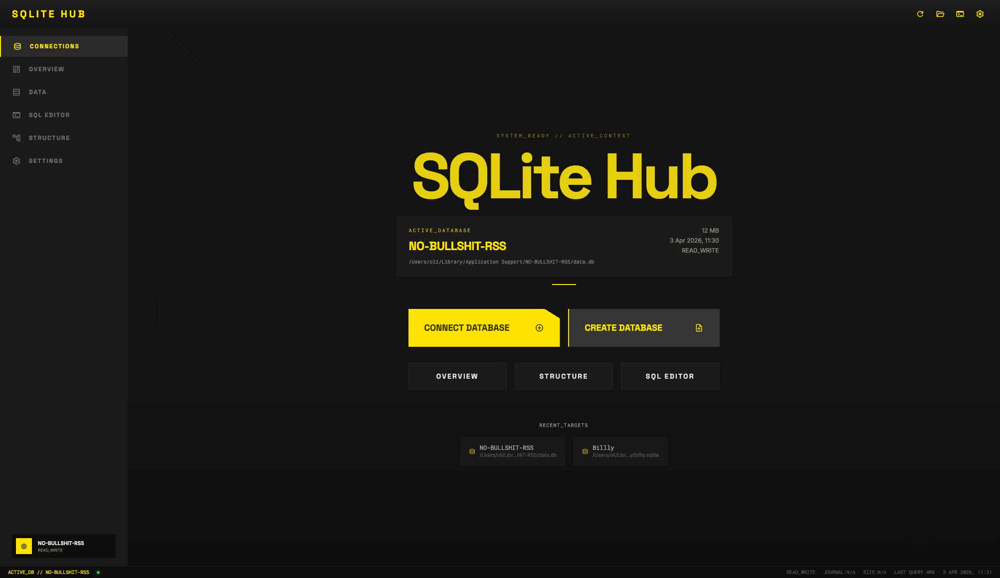
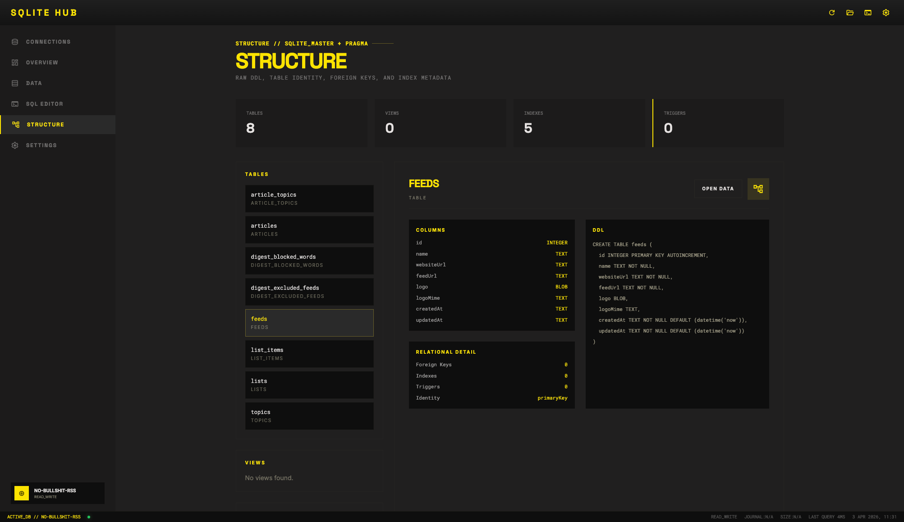
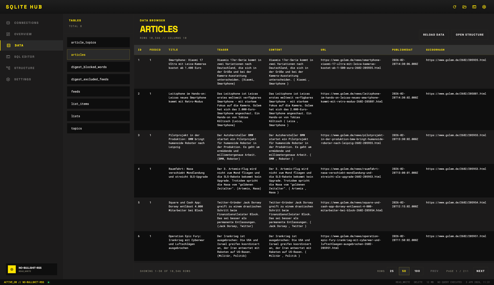
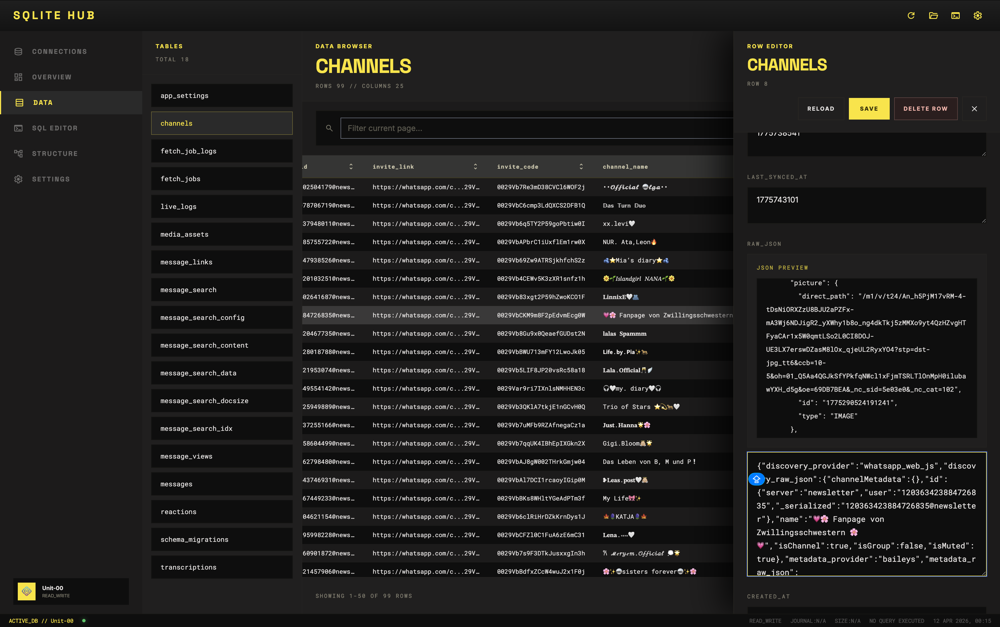
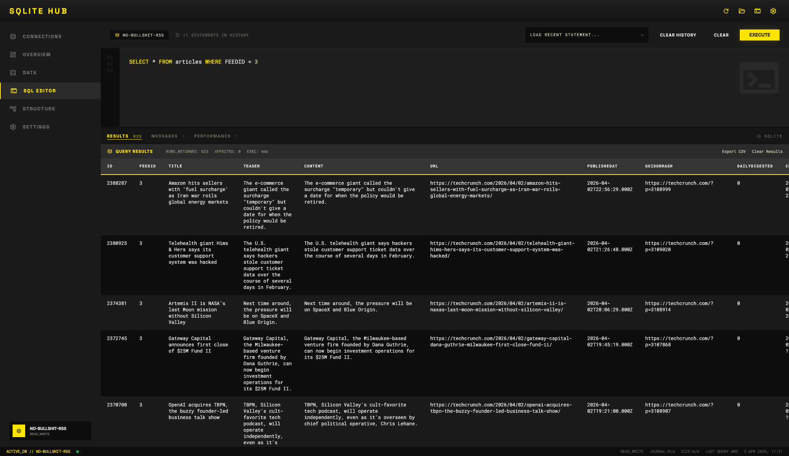

# sqlite-hub ⚡️



A focused local-first app for browsing, editing, and querying SQLite databases.

SQLite Hub is built for developers and technical users who want a clean SQLite workflow without heavy database clients, cloud layers, or dashboard noise.

## Why SQLite Hub?

Many database tools are powerful, but feel oversized when all you want is to inspect a local SQLite file, edit a few rows, and run a query fast.

SQLite Hub keeps that workflow sharp:

- browse tables and rows
- filter, sort, page through, and export table data
- inspect schema, structure, and relationships
- edit records in place with an SQL diff preview before saving
- export tables and query results as CSV, TSV, Markdown, duplicate as table
- create simple local backups of the active database
- run SQL in a syntax-highlighted editor with history, messages, and performance metrics
- turn query-history results into local charts
- create and edit tables with a live SQL preview
- stay local and move fast

## Features

### Structure view



Inspect tables, columns, types, indexes, foreign keys, and schema details without losing pace. The graph view visualizes relationships, the table list is searchable, and SQLite Hub remembers the last selected table while you move between views.

### Data browser



Scan rows, sort fast, move through local data quickly, and export full tables as CSV. The Data browser supports table search, page sizes up to 250 rows, and advanced filters with column/operator/value controls. Text filters support case-insensitive `contains`, `not contains`, and exact `equals` matching.

### Row editing



Open one record, edit it in place, preview the SQL diff, then commit. SQLite Hub only enables row edits when it can target a stable row identity safely.

### SQL editor



Write queries in a syntax-highlighted editor, inspect results in the same workflow, and export result sets as CSV. Query drafts survive reloads, query history can be searched and saved, and direct single-table `SELECT` results can be edited from the result grid.

The bottom panel keeps separate tabs for:

- Results
- Performance, including execution time, statement count, returned rows, affected rows, and serialized result memory size
- Messages, including the executed query and statement updates/errors

Potentially destructive statements are tracked in query history, and SQLite Hub keeps the active result tab instead of forcing you back to Results after every execution.

### Query history

SQLite Hub stores query history per database. You can search SQL, titles, and notes; mark useful queries as saved; re-run previous queries; and execute saved queries from the CLI.

### Charts

Create charts from chartable `SELECT` query-history entries. Charts can be saved per query, reopened later, and rendered from live query results.

### Table Designer

Create and edit SQLite tables from the UI. The Table Designer includes a searchable table list, column controls, CSV import drafting, and a live SQL preview that can be hidden or shown.

### Media Tagging

Configure a media table, tag table, and mapping table, then work through a tagging queue for image, video, and audio assets. The workflow supports preview controls, skipped items, parent tags, and applying selected tags to the current media row.

### UI preferences

SQLite Hub remembers common workspace preferences in local storage, including hidden panels, selected editor tabs, query drafts, chart panels, table row size, and Table Designer preview visibility.

### Simple backups

Create timestamped local backups of the active SQLite database in one click. Backups are stored as plain file copies in a local `backups` folder next to the database.

### Local-first

Built around local SQLite files, not hosted dashboards or team complexity.

## Install

### Homebrew

```bash
brew tap oliverjessner/tap
brew install sqlite-hub
```

### NPM

```bash
npm install -g sqlite-hub
```

## Alternative port

```bash
sqlite-hub --port:4174
```

## CLI Interface

SQLite Hub ships with a built-in CLI that lets you start the app or query information about your imported databases directly from the terminal.

### Start the app

```bash
sqlite-hub                  # start on default port 4173
sqlite-hub --port:4174      # start on a custom port
sqlite-hub --help           # show help text
sqlite-hub --version        # show version number
```

### List all imported databases

```bash
sqlite-hub --database
sqlite-hub -d
```

Shows an overview of all databases that have been opened in SQLite Hub, including:

- database name/label
- file path
- file size
- last opened timestamp
- read-only status

### Query specific database details

Retrieve details about a single database by its name (case-insensitive):

```bash
sqlite-hub --database-path:Billly     # get the file path
sqlite-hub --database-size:Billly     # get the file size (human-readable)
sqlite-hub --database-lastopened:Billly  # get last opened timestamp
```

### List all tables in a database

```bash
sqlite-hub --database-tables:Billly
```

Opens the database in read-only mode and prints all table names, sorted alphabetically.

### SQL Editor - Saved Queries

List all saved queries for a database:

```bash
sqlite-hub --database:Unit-00 --sqleditor
```

Execute a specific saved query by name:

```bash
sqlite-hub --database:Unit-00 --sqleditor:"15min Posting Buckets without id 96"
```

This searches the query history for the given database, finds the matching saved query by title, executes it, and returns all results with metadata (row count, columns, timing, and data).

### Available flags

| Flag                                  | Description                           |
| ------------------------------------- | ------------------------------------- |
| `--help`, `-h`                        | Show help text                        |
| `--version`, `-v`                     | Show version number                   |
| `--port:PORT`                         | Start the server on a custom port     |
| `--database`, `-d`                    | List all imported databases           |
| `--database-path:name`                | Get the file path of a database       |
| `--database-size:name`                | Get the size of a database            |
| `--database-lastopened:name`          | Get the last opened timestamp         |
| `--database-tables:name`              | Get all table names from a database   |
| `--database:name --sqleditor`         | List all saved queries for a database |
| `--database:name --sqleditor:"query"` | Execute a saved query by name         |

### SQL editor CLI example


In the screenshot above, you can see a saved query from the SQL editor. You can create these queries using the graphical interface and execute them via the CLI if you want. To execute one, you would run:

```bash
sqlite-hub --database:Unit-00 --sqleditor:"Group by creation Year"
```

Example output:

```bash
Executing: Group by creation Year
SQL: SELECT STRFTIME('%Y', creation_time, 'unixepoch') AS creation_year, COUNT(*) AS channel_count FROM channels WHERE creation_time IS NOT NU...
────────────────────────────────────────────────────────────

Statement count: 1
Timing: 1ms

Statement 1 (resultSet):
Rows: 3
Columns: creation_year, channel_count

Results:
  [0] 2024 | 11
  [1] 2025 | 47
  [2] 2026 | 40
```

## Changelog

[Changelog](./docs/changelog.md)
