# sqlite-hub ⚡️

[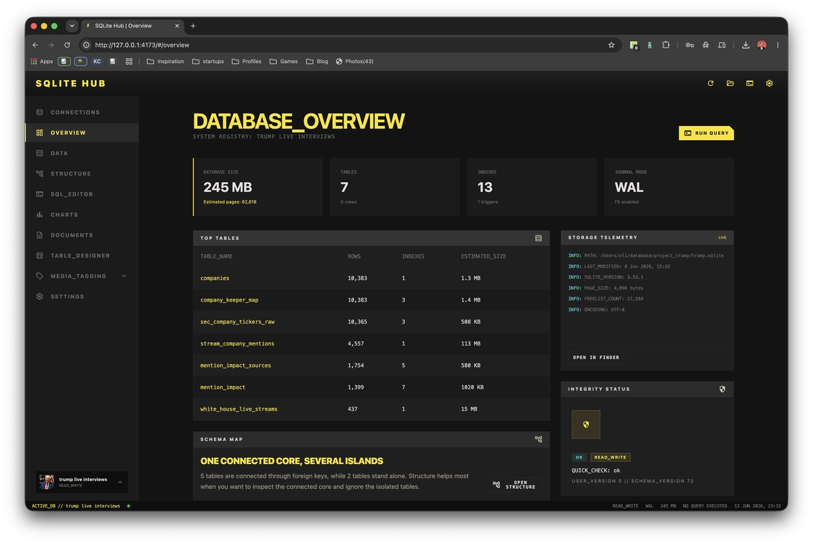](./frontend/assets/mockups/overview_1200.webp)

A focused local-first app for browsing, editing, and querying SQLite databases.

SQLite Hub is built for developers and technical users who want a clean SQLite workflow without heavy database clients, cloud layers, or dashboard noise.

## Why SQLite Hub?

Many database tools are powerful, but feel oversized when all you want is to inspect a local SQLite file, edit a few rows, and run a query fast.

SQLite Hub keeps that workflow sharp:

- browse tables and rows
- open existing databases or create new SQLite files with a native save dialog
- manage recent connections with labels, custom icons, and read-only mode
- inspect database health, storage metrics, and schema connectivity from one overview
- filter, sort, page through, and export table data
- inspect schema, structure, and relationships
- edit records in place with typed value previews and an SQL diff preview before saving
- export tables and query results as CSV, TSV, Markdown, JSON, Parquet, or duplicate them as a table
- copy result columns with formatting, headers, first-10 previews, TXT export, and Markdown todo export
- keep database-scoped Markdown documents with previews, autosave, imports, exports, and saved-query inserts
- switch between recent databases with sidebar quick picks
- create simple local backups of the active database
- run and format SQL in a syntax-highlighted editor with history, messages, and performance metrics
- keep large interactive query results bounded while full exports remain available
- turn query-history results into local charts
- create and edit tables with a live SQL preview
- stay local and move fast

## Features

### Connections

[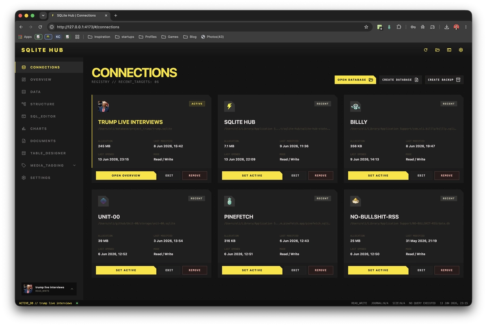](./frontend/assets/mockups/connections_1200.webp)

Open an existing SQLite file with a native file picker or create a new database with a native save dialog from the Connections view. Manual absolute-path entry remains available as a fallback for both actions.

Recent connections show file size, modification time, last-opened time, and access mode. Connections can be activated, relabeled, moved to another path, opened read-only, assigned a PNG/JPG/WEBP icon, reset to the default icon, or removed from the recent-connections registry without deleting the database file.

### Overview

The database overview combines operational and schema information for the active database:

- file size, page count, table/view counts, index/trigger counts, journal mode, and foreign-key status
- largest tables by row count and estimated size
- database path, modification time, SQLite version, page size, freelist count, and encoding
- schema-map statistics for foreign-key links, connected clusters, and isolated tables
- integrity and quick-check results, access mode, user version, and schema version
- shortcuts to the SQL Editor, Structure view, and the database location in Finder

### Structure view

<p>
  <a href="./frontend/assets/mockups/structure_1_1200.webp">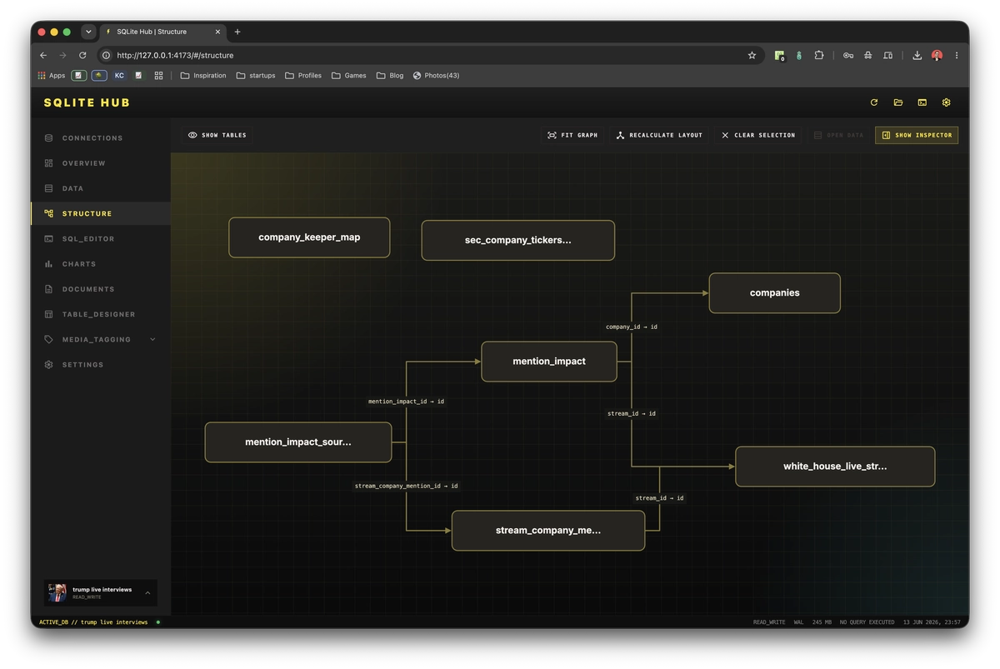</a>
  <a href="./frontend/assets/mockups/structure_2_inspector_1200.webp">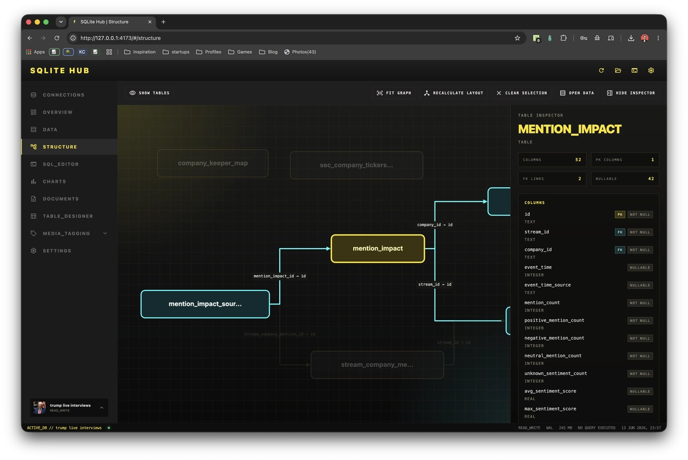</a>
</p>

Inspect tables, views, indexes, triggers, columns, declared types, primary keys, nullability, foreign keys, and DDL without losing pace. The searchable object list and relationship graph support fit, relayout, selection clearing, direct navigation to table data, and a hideable inspector/sidebar. Clicking a relationship edge opens a join preview with the mapped columns and a copyable SQL `JOIN` snippet. SQLite Hub remembers the last selected table while you move between views, and DDL can be copied directly from the inspector.

### Data browser

[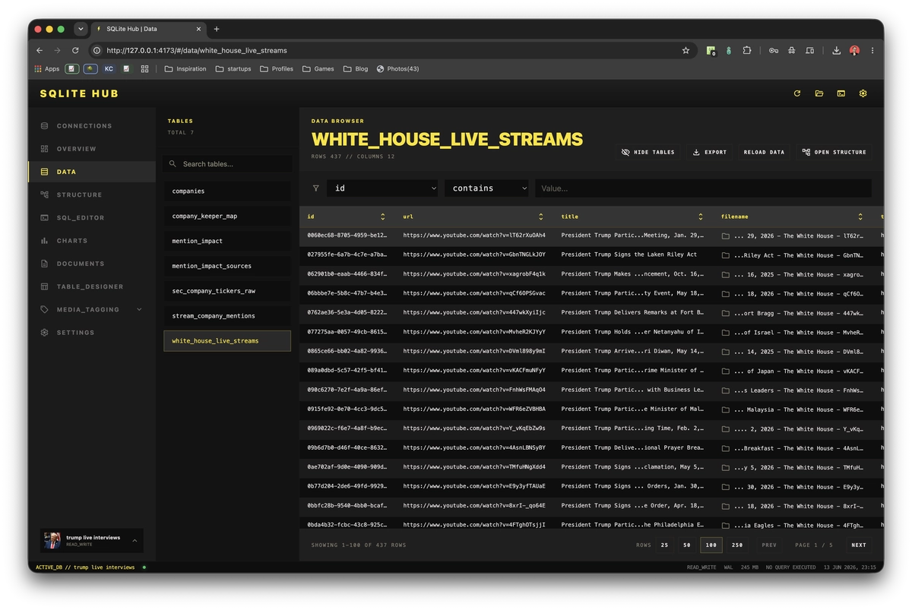](./frontend/assets/mockups/data_1_1200.webp)

Scan rows, sort columns, move through local data quickly, and export full tables as CSV, TSV, Markdown, JSON, or Parquet. The Data browser also supports duplicating exports as a new table, searchable and hideable table navigation, page sizes up to 250 rows, and advanced filters with column/operator/value controls. Text filters support case-insensitive `contains`, `not contains`, and exact `equals` matching.

Wide tables keep their horizontal scroll position when sorting causes the grid to re-render. Cells use compact previews for long values, BLOBs, and detected file paths, while exports retain complete BLOB content.

### Row editing

[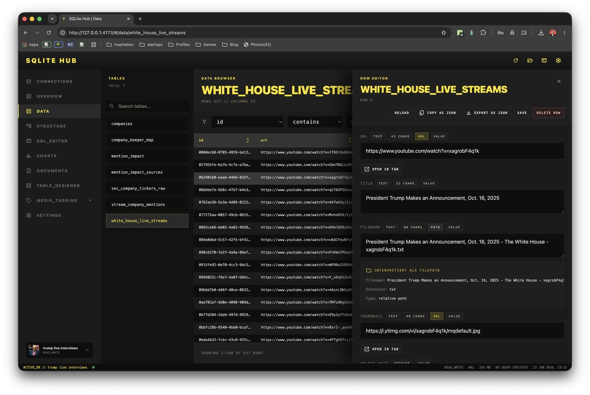](./frontend/assets/mockups/data_2_row_editor_1200.webp)

Open one record, edit it in place, preview the generated SQL and changed values, then commit or delete the row with confirmation. SQLite Hub only enables row edits when it can target a stable primary-key or rowid identity safely.

The Row Editor adds contextual previews without changing the stored raw value:

- visible `NULL`, `EMPTY STRING`, and `VALUE` states, with untouched `NULL` values preserved on save
- formatted JSON object and array previews with indentation and line breaks
- full-row JSON preview with copy and `.json` export actions
- clickable HTTP/HTTPS URL detection
- file-path detection with filename, directory, extension, and path type
- timestamp interpretation for plausible numeric, ISO, and SQLite datetime values while protecting key columns
- character counts for non-empty text values
- select controls for simple string `CHECK (... IN (...))` constraints

### SQL editor

[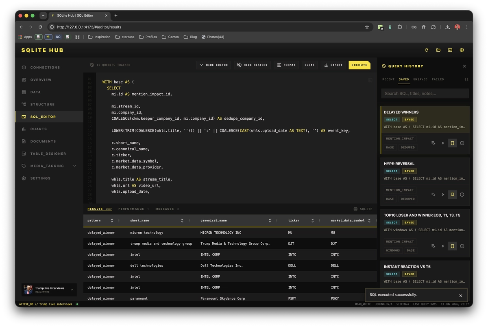](./frontend/assets/mockups/sql_editor_1_1200.webp)

Write queries in a syntax-highlighted editor, execute them with the Run button or `Shift + Enter`, format SQL with the editor Format button, inspect results in the same workflow, and export result sets as CSV, TSV, Markdown, JSON, Parquet, or duplicate them as a table. Query drafts survive reloads, query history can be searched and saved, and direct single-table `SELECT` results can be edited or deleted from the result grid when a stable row identity is available.

Interactive result sets are limited to the first 5,000 rows to keep the application responsive. A visible notice and Messages entry indicate truncation; CSV, TSV, Markdown, JSON, Parquet, and duplicate-table exports execute without that interactive row limit and include complete BLOB values. Sorting wide results preserves the horizontal scroll position.

[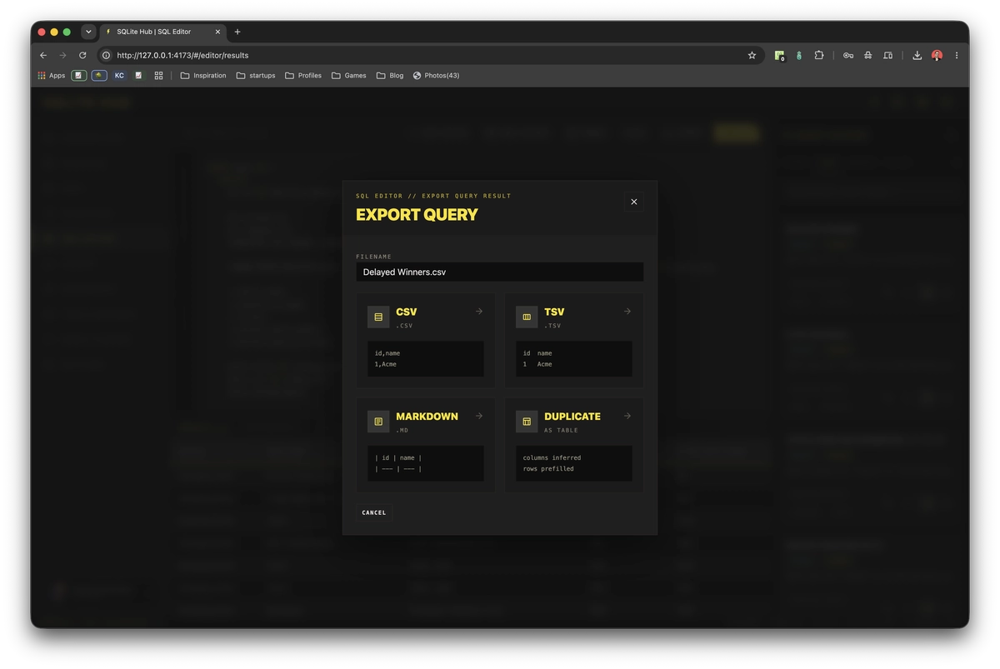](./frontend/assets/mockups/sql_editor_5_export_query_result_1200.webp)

Result column menus include copy actions for a full column, a column with header, or the first 10 values. The same modal can preview the output, copy it, export it as TXT, or turn a column into Markdown todo items.

<p>
  <a href="./frontend/assets/mockups/sql_editor_3_export_column_1200.webp">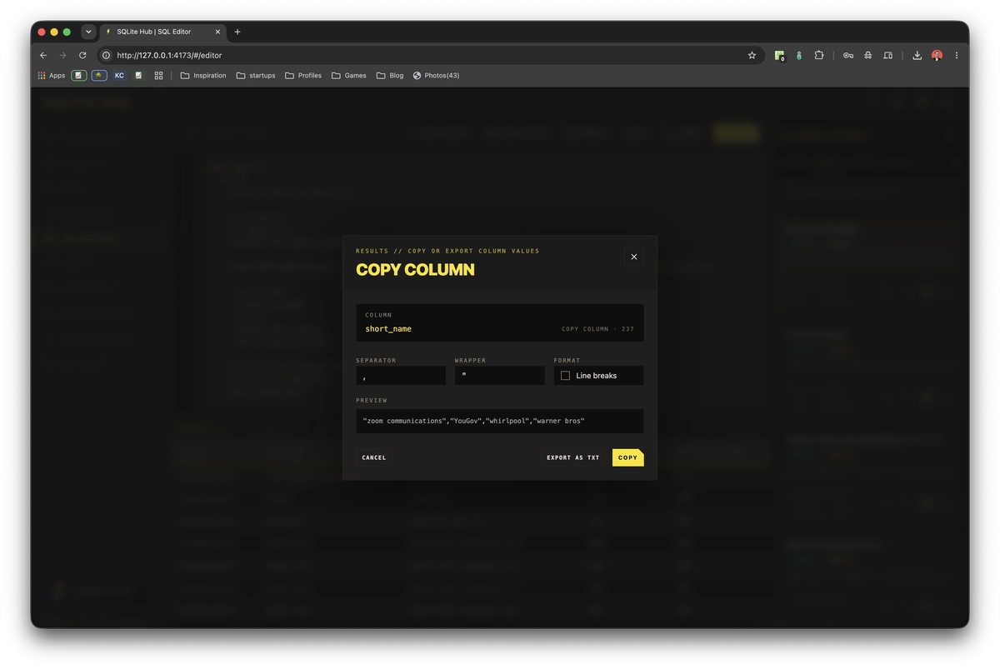</a>
  <a href="./frontend/assets/mockups/sql_editor_4_export_column_as_markdown_1200.webp">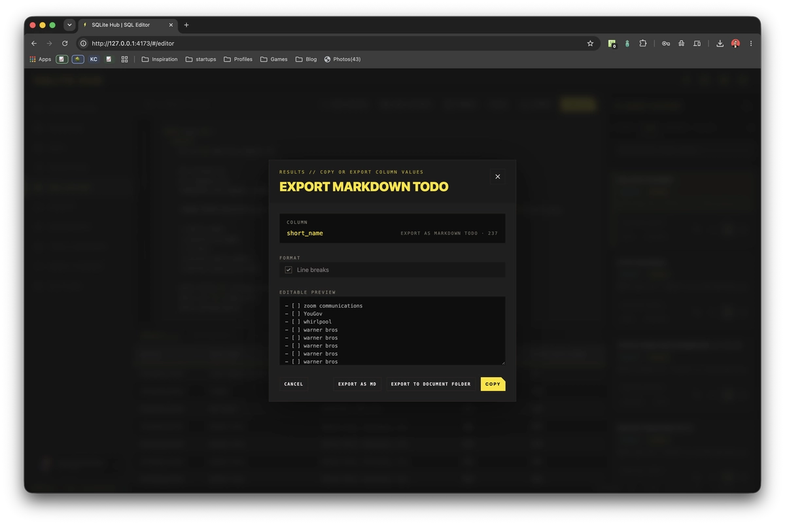</a>
</p>

The bottom panel keeps separate tabs for:

- Results
- Performance, including execution time, statement count, returned rows, affected rows, and serialized result memory size
- Messages, including the executed query and statement updates/errors

Potentially destructive statements are tracked in query history, and SQLite Hub keeps the active result tab instead of forcing you back to Results after every execution. Multi-statement SQL is reported statement by statement, including returned rows, affected rows, truncation warnings, executed SQL, errors, timing, and serialized result size.

### Query history

[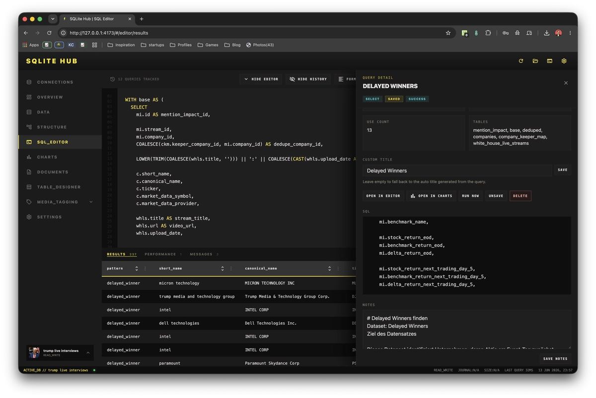](./frontend/assets/mockups/sql_editor_2_query_details_1200.webp)

SQLite Hub stores query history per database. You can browse recent and saved tabs, search SQL, titles, and notes, assign titles and notes, mark useful queries as saved, delete history entries, load older entries, re-run previous queries, reopen them in the editor, and execute saved queries from the CLI.

### Documents

[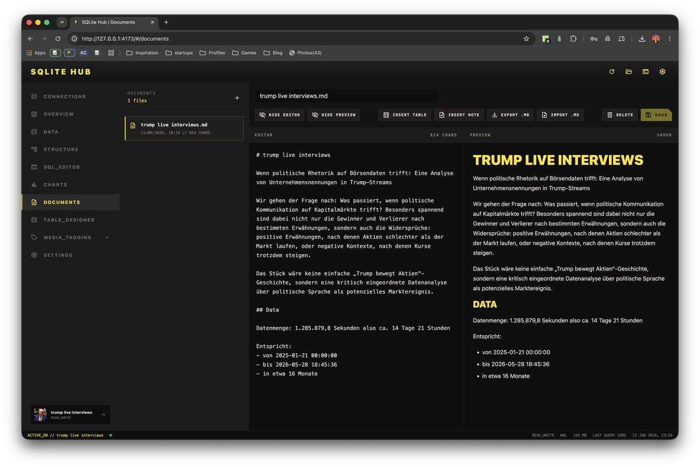](./frontend/assets/mockups/documents_1200.webp)

Documents are local Markdown notes scoped to the active database. SQLite Hub creates a document folder per database, keeps the sidebar fixed while the editor and preview panes scroll independently, and autosaves changes after a short debounce. You can create, rename, delete, import `.md` files, export the current document as Markdown, and toggle the editor or preview pane as needed.

The preview supports regular Markdown, ordered and unordered lists, tables, code blocks, links, and clickable task-list checkboxes. Documents can also pull context from saved SQL Editor queries:

- Insert Table opens a saved-query picker and inserts that query's result using the same Markdown table export logic as the SQL Editor.
- Insert Note opens saved queries that have notes and inserts the selected note directly into the document.
- Markdown Todo column exports from query results can create a new document without embedding the original SQL query.

### Charts

[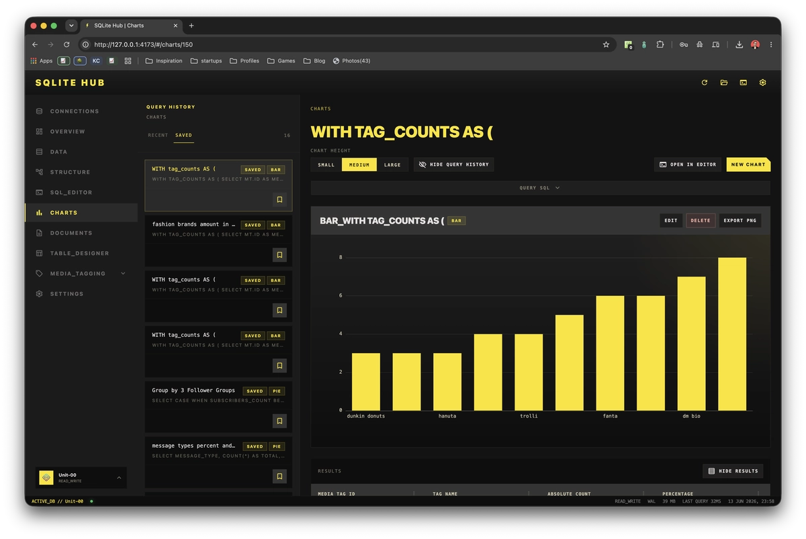](./frontend/assets/mockups/charts_1_bars_1200.webp)

Create bar, line, pie/donut, and scatter charts from chartable `SELECT` query-history entries. Charts can be saved per query, edited, deleted, resized, reopened later, rendered from live query results, and exported as PNG. Chart configuration supports compatible column selection, sorting, labels, legends, line smoothing, scatter series, and optional scatter point sizing.

<p>
  <a href="./frontend/assets/mockups/charts_2_pie_1200.webp">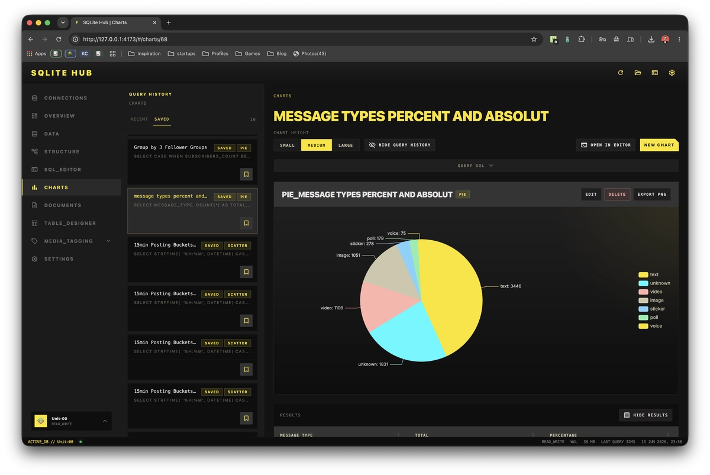</a>
  <a href="./frontend/assets/mockups/charts_3_scatter_plot_1200.webp">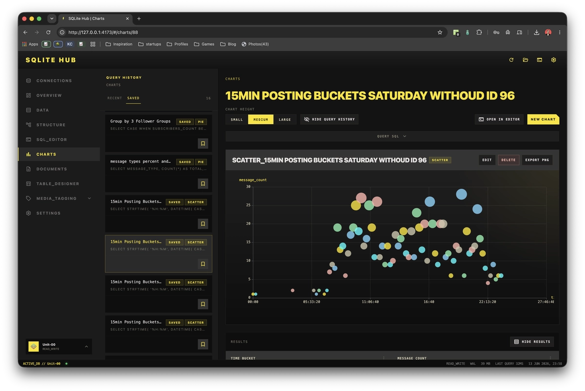</a>
</p>

### Table Designer

[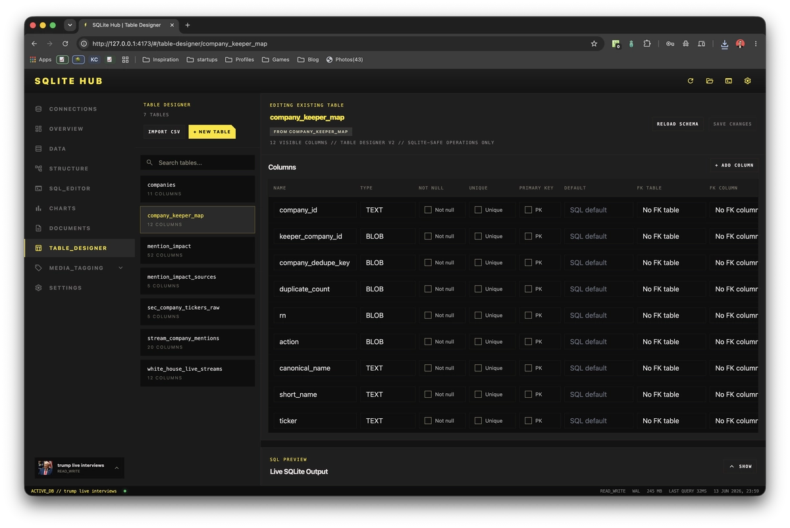](./frontend/assets/mockups/table_designer_1_1200.webp)

Create and edit SQLite tables from the UI. The Table Designer includes a searchable table list, validation and migration warnings, and controls for column names, SQLite types, `NOT NULL`, `UNIQUE`, primary keys, SQL defaults, foreign-key tables/columns, and check constraints. Existing composite unique constraints are surfaced as schema metadata.

CSV files can seed a new table draft and optionally fill the created table with imported rows. Every change produces a copyable live SQL preview that can be hidden or shown before the schema operation is applied.

[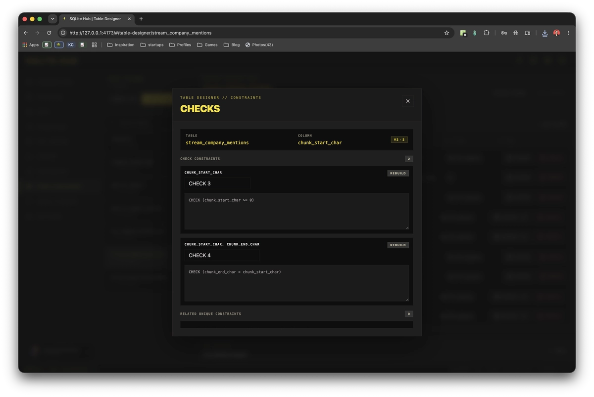](./frontend/assets/mockups/table_designer_2_checks_1200.webp)

### Media Tagging

[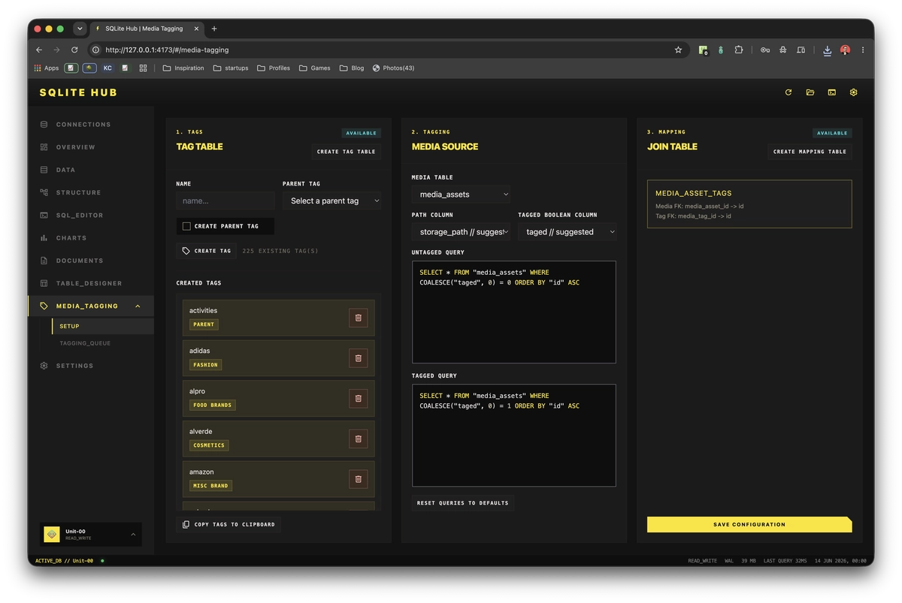](./frontend/assets/mockups/media_tagging_1_setup_1200.webp)

Configure a media table, path/status columns, tag table, mapping table, and the SQL queries that drive tagged and untagged queues. SQLite Hub can create the default tag and mapping tables, validate the setup, reset default queries, and preview image, video, and audio assets from paths scoped to the active database directory.

The queue supports tag search, tag creation/removal, parent tags, copying tags from the previous item, applying selected tags, skipping items, resetting skipped items, rotating visual media, hiding/showing media details, and opening the current row in Data or Structure. `Shift + Enter` applies the selected tags and advances to the next item.

<p>
  <a href="./frontend/assets/mockups/media_tagging_2_tagging_queue_1200.webp">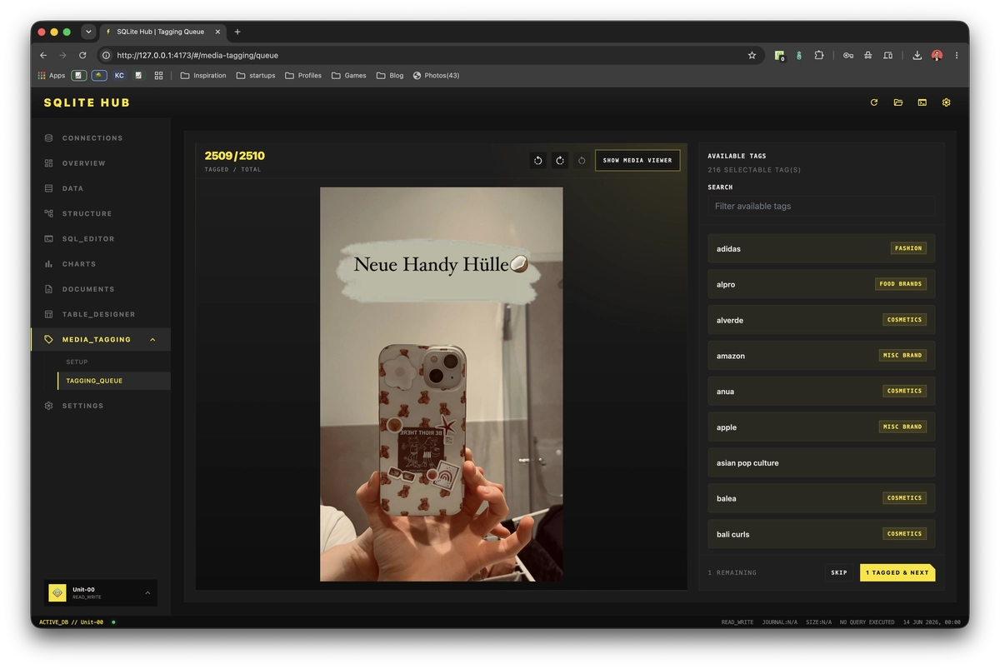</a>
  <a href="./frontend/assets/mockups/media_tagging_3_media_viewer_1200.webp">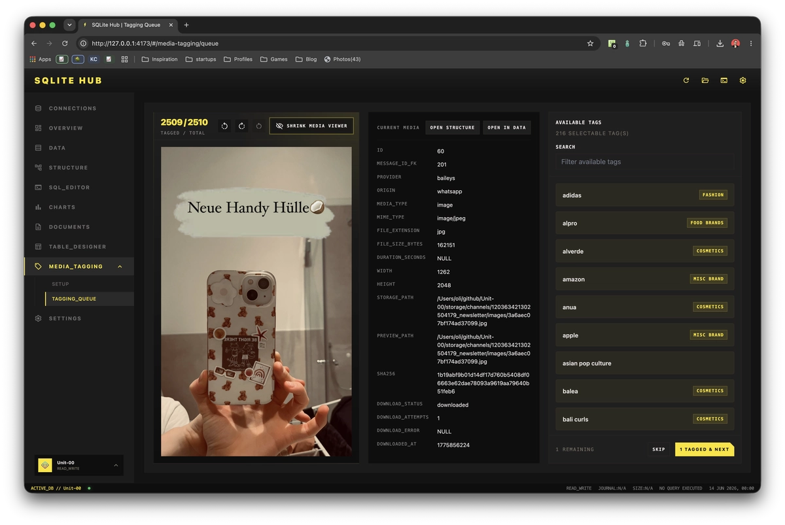</a>
</p>

### UI preferences

SQLite Hub remembers common workspace preferences in local storage, including hidden panels, selected editor tabs, query drafts, chart panels, table row size, and Table Designer preview visibility.

### Settings

[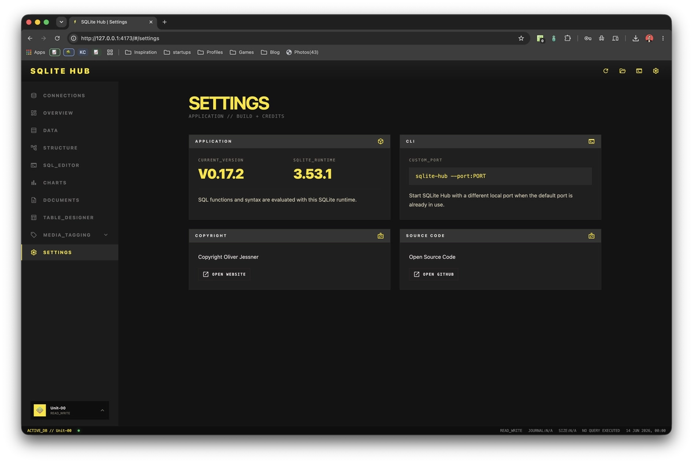](./frontend/assets/mockups/settings_1200.webp)

The Settings view reports the installed SQLite Hub version and the actual SQLite runtime version used to execute queries. It also keeps the custom-port CLI command, project website, and source repository available in the application.

### Database quick picks

The active database footer in the sidebar opens a quick-pick panel with the five most recent databases, so you can switch databases without going back to the Connections view.

### Simple backups

Create timestamped local backups of the active SQLite database in one click. Backups are stored as plain file copies in a local `backups` folder next to the database.

### Local-first

Built around local SQLite files, not hosted dashboards or team complexity. The server binds explicitly to the IPv4 loopback interface, and API middleware rejects foreign hosts and cross-origin mutations while still allowing same-origin browser and local CLI requests.

## Install

### Homebrew

```bash
brew tap oliverjessner/tap
brew install sqlite-hub
```

### NPM

```bash
npm install -g sqlite-hub
```

## Alternative port

```bash
sqlite-hub --port:4174
```

## CLI Interface

SQLite Hub ships with a built-in CLI that lets you start the app or query information about your imported databases directly from the terminal.

### Start the app

```bash
sqlite-hub                  # start on default port 4173
sqlite-hub --port:4174      # start on a custom port
sqlite-hub --open           # open SQLite Hub in the browser
sqlite-hub --config         # show port, URL, app version, and SQLite version
sqlite-hub --help           # show help text
sqlite-hub --version        # show version number
```

### List all imported databases

```bash
sqlite-hub --database
sqlite-hub -d
```

Shows an overview of all databases that have been opened in SQLite Hub, including:

- database name/label
- file path
- file size
- last opened timestamp
- read-only status

### Query specific database details

Retrieve details about a single database by its name (case-insensitive):

```bash
sqlite-hub --database:Billly --path        # get the file path
sqlite-hub --database:Billly --size        # get the file size
sqlite-hub --database:Billly --lastopened  # get last opened timestamp
```

### List all tables in a database

```bash
sqlite-hub --database:Billly --tables
```

Opens the database in read-only mode and prints all table names, sorted alphabetically.

### Inspect a table

```bash
sqlite-hub --database:Billly --table:companies
```

Prints table metadata such as columns, primary keys, foreign keys, indexes, row count, and row identity strategy.

### SQL Editor - Saved Queries

List all saved queries for a database:

```bash
sqlite-hub --database:Unit-00 --queries
```

Execute a specific saved query by name:

```bash
sqlite-hub --database:Unit-00 --execute:"15min Posting Buckets without id 96"
```

This searches the query history for the given database, finds the matching saved query by title, executes it, and returns all results with metadata (row count, columns, timing, and data).

Show the saved query SQL without executing it:

```bash
sqlite-hub --database:Unit-00 --query:"Stock Winners"
```

Show the saved notes for a query:

```bash
sqlite-hub --database:Unit-00 --notes:"TOP25 Loser and Winner EOD, T1, T3, T5"
```

Export a saved query using the same CSV, TSV, Markdown, and JSON export logic as the SQL Editor:

```bash
sqlite-hub --database:Unit-00 --export:"Stock Winners" --format:csv
sqlite-hub --database:Unit-00 --export:"Stock Winners" --format:tsv
sqlite-hub --database:Unit-00 --export:"Stock Winners" --format:md
sqlite-hub --database:Unit-00 --export:"Stock Winners" --format:json
```

The export is written to the current working directory using the generated query export filename.

### Documents CLI

List all Markdown documents stored for a database:

```bash
sqlite-hub --database:Unit-00 --documents
```

Print one document's Markdown content:

```bash
sqlite-hub --database:Unit-00 --documents:"Research Notes"
```

Export one document as a `.md` file into the current working directory:

```bash
sqlite-hub --database:Unit-00 --documents:"Research Notes" --export
sqlite-hub --database:Unit-00 --documents:"Research Notes--export"
```

Documents can be matched by id, filename, title, or a partial filename/title match.

### Row JSON export

Export a single row as JSON by primary key or rowid, using the same row-shaping logic as the Row Editor:

```bash
sqlite-hub --database:Unit-00 --table:companies --export:0a754aba373d34972998792a0be4333c
```

### Available flags

| Flag                                                            | Description                                     |
| --------------------------------------------------------------- | ----------------------------------------------- |
| `--help`, `-h`                                                  | Show help text                                  |
| `--version`, `-v`                                               | Show version number                             |
| `--config`                                                      | Show port, URL, app version, and SQLite version |
| `--open`                                                        | Open SQLite Hub in the browser                  |
| `--port:PORT`                                                   | Start the server on a custom port               |
| `--database`, `-d`                                              | List all imported databases                     |
| `--database:name`                                               | Select a database by name or id                 |
| `--database:name --path`                                        | Get the file path of a database                 |
| `--database:name --size`                                        | Get the size of a database                      |
| `--database:name --lastopened`                                  | Get the last opened timestamp                   |
| `--database:name --tables`                                      | Get all table names from a database             |
| `--database:name --queries`                                     | List saved queries for a database               |
| `--database:name --execute:"query"`                             | Execute a saved query by name                   |
| `--database:name --query:"query"`                               | Print a saved query by name                     |
| `--database:name --notes:"query"`                               | Print saved notes for a query                   |
| `--database:name --export:"query" --format:csv\|tsv\|md\|json` | Set query export format                         |
| `--database:name --documents`                                   | List Markdown documents for a database          |
| `--database:name --documents:"document"`                        | Print a document's Markdown content             |
| `--database:name --documents:"document" --export`               | Export a document as Markdown                   |
| `--database:name --table:"table"`                               | Print table metadata                            |
| `--database:name --table:"table" --export:"pk"`                 | Export one row as JSON                          |

Legacy aliases such as `--database-path:name`, `--database-size:name`, `--database-lastopened:name`, `--database-tables:name`, and `--database:name --sqleditor:"query"` still work.

### SQL editor CLI example

Saved queries created in the graphical SQL Editor can also be executed through the CLI. To execute one, run:

```bash
sqlite-hub --database:Unit-00 --execute:"Group by creation Year"
```

Example output:

```bash
Executing: Group by creation Year
SQL: SELECT STRFTIME('%Y', creation_time, 'unixepoch') AS creation_year, COUNT(*) AS channel_count FROM channels WHERE creation_time IS NOT NU...
────────────────────────────────────────────────────────────

Statement count: 1
Timing: 1ms

Statement 1 (resultSet):
Rows: 3
Columns: creation_year, channel_count

Results:
  [0] 2024 | 11
  [1] 2025 | 47
  [2] 2026 | 40
```

## API

SQLite Hub also provides a local JSON API for database metadata, tables, saved queries, exports, and documents. Access is protected by database-specific API tokens created in Settings. See the [API documentation](./docs/API.md) for authentication, endpoints, and examples.

## Changelog

[Changelog](./docs/changelog.md)
